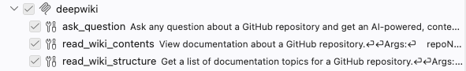
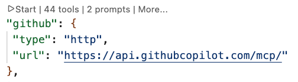
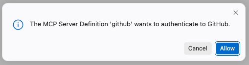
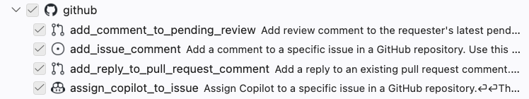

# Exercise 1: MCP Servers and Coding Agents

In this exercise, you'll set up a development environment, connect a coding agent to public MCP servers, and then try an authenticated MCP server.

- [Step 1: Set up your development environment](#step-1-set-up-your-development-environment)
- [Step 2: Set up a coding agent](#step-2-set-up-a-coding-agent)
- [Step 3: Use a public MCP server (no auth)](#step-3-use-a-public-mcp-server-no-auth)
- [Step 4: Use an authenticated MCP server (GitHub)](#step-4-use-an-authenticated-mcp-server-github)

---

## Step 1: Set up your development environment

Pick **one** of the options below to get the tutorial repository open and ready.

### Option A: GitHub Codespaces (recommended)

Everything is pre-configured — no local installs needed. You just need a [GitHub account](https://github.com/).

1. Go to [github.com/pamelafox/pycon2026-mcp-tutorial](https://github.com/pamelafox/pycon2026-mcp-tutorial).
2. Click **Code → Codespaces → Create codespace on main**.
3. Wait for the Codespace to build. Once the editor loads, you're ready to move on to [Step 2](#step-2-set-up-a-coding-agent).

### Option B: VS Code + Dev Containers

This runs the same pre-configured environment locally inside a Docker container.

**Prerequisites:**

- [VS Code](https://code.visualstudio.com/) installed
- [Docker Desktop](https://www.docker.com/products/docker-desktop/) installed and running
- [Dev Containers extension](https://marketplace.visualstudio.com/items?itemName=ms-vscode-remote.remote-containers) installed in VS Code

**Steps:**

1. Clone the repository:

   ```bash
   git clone https://github.com/pamelafox/pycon2026-mcp-tutorial.git
   ```

2. Open the folder in VS Code:

   ```bash
   code pycon2026-mcp-tutorial
   ```

3. When prompted "Reopen in Container", click **Reopen in Container**. (Or open the Command Palette and run **Dev Containers: Reopen in Container**.)
4. Wait for the container to build. Once the editor reloads, you're ready to move on to [Step 2](#step-2-set-up-a-coding-agent).

### Option C: Local environment

If you prefer to work without Docker or Codespaces, you can set up a local Python environment.

**Prerequisites:**

- [Python 3.12+](https://www.python.org/downloads/) installed
- [uv](https://docs.astral.sh/uv/getting-started/installation/) installed (Python package manager)

**Steps:**

1. Clone the repository:

   ```bash
   git clone https://github.com/pamelafox/pycon2026-mcp-tutorial.git
   cd pycon2026-mcp-tutorial
   ```

2. Install dependencies:

   ```bash
   uv sync
   ```

3. Open the folder in your editor of choice (VS Code, PyCharm, etc.). Once the editor loads, you're ready to move on to [Step 2](#step-2-set-up-a-coding-agent).

---

## Step 2: Set up a coding agent

Set up **one** of the coding agents from instructions below, either [GitHub Copilot in VS Code](#option-a-github-copilot-in-vs-code), [GitHub Copilot CLI](#option-b-github-copilot-cli), or [Claude Code](#option-c-claude-code). You are welcome to use another MCP-compatible coding agent if you have one installed, but agents vary in how fully they support MCP features, so you may encounter issues.

### Option A: GitHub Copilot in VS Code

1. Make sure the [GitHub Copilot extension](https://marketplace.visualstudio.com/items?itemName=GitHub.copilot) is installed. If you opened this project in Codespaces, the extension is pre-installed.
2. At the top of VS Code, locate and click the Toggle Chat icon to open a Copilot Chat side panel.
  

   > 🪧 **Note:** If this is your first time using GitHub Copilot, you will need to accept the usage terms to continue.

3. Make sure the chat is in **Agent** mode.

   

### Option B: GitHub Copilot CLI

> You need a [GitHub Copilot subscription](https://github.com/features/copilot) for this option.

1. Install GitHub Copilot CLI by following the [installation guide](https://docs.github.com/en/copilot/how-tos/copilot-cli/set-up-copilot-cli/install-copilot-cli).
2. Verify the installation:

   ```bash
   copilot
   ```

### Option C: Claude Code

> You need a [Claude Code](https://code.claude.com/) subscription for this option.

1. Install Claude Code by following the [installation guide](https://code.claude.com/docs/en/overview).
2. Verify the installation:

   ```bash
   claude
   ```

For more details on MCP in Claude Code, see the [Claude Code MCP docs](https://code.claude.com/docs/en/mcp).

---

## Step 3: Use a public MCP server (no auth)

Now connect your coding agent to a **public MCP server** that requires no authentication. Pick one (or both!) of the servers below:

| Server | MCP Server URL | Description |
| --- | --- | --- |
| [DeepWiki](https://docs.devin.ai/work-with-devin/deepwiki-mcp) | `https://mcp.deepwiki.com/mcp` | GitHub repository documentation |
| [Microsoft Learn](https://learn.microsoft.com/training/support/mcp) | `https://learn.microsoft.com/api/mcp` | MS Learn documentation |
| [French government](https://github.com/datagouv/datagouv-mcp) | `https://mcp.data.gouv.fr/mcp` | French government data |

Follow the instructions for your agent:

### Copilot in VS Code — public server

1. Open (or create) the file `.vscode/mcp.json` in your workspace and make sure it contains a server configuration pointed at the remote MCP server URL:


   ```json
   {
     "servers": {
       "deepwiki": {
         "type": "http",
         "url": "https://mcp.deepwiki.com/mcp"
       }
     }
   }
   ```

2. In the Copilot Chat panel, click the tools icon (🔧) to confirm the server tools are listed.

   

3. Ask a question that can be answered by the MCP server:

   > Explain how PrefectHQ/fastmcp handles tool registration internally.

4. Approve the MCP tool call and review the grounded answer.

### Copilot CLI — public server

1. Add the MCP server using the CLI:

   ```bash
   copilot mcp add --transport http deepwiki https://mcp.deepwiki.com/mcp
   ```

2. Ask a question that can be answered by the MCP server:

   ```bash
   copilot -i "Explain how PrefectHQ/fastmcp handles tool registration internally."
   ```

### Claude Code — public server

1. Add the server:

   ```bash
   claude mcp add --transport http deepwiki https://mcp.deepwiki.com/mcp
   ```

2. Verify it was added:

   ```bash
   claude mcp list
   ```

3. Ask a question that can be answered by the MCP server:

   ```bash
   claude "Use the deepwiki MCP server to explain how PrefectHQ/fastmcp handles tool registration internally."
   ```

   Note that we specifically mentioned the MCP server in this question, as Claude has a built-in web search tool that it tries to use instead.

---

## Step 4: Use an authenticated MCP server (GitHub)

> You need a [GitHub account](https://github.com) for this step. If you do not have one, you can try other [remote servers that require OAuth](https://mcpservers.org/remote-mcp-servers).

The [GitHub MCP server](https://github.com/github/github-mcp-server) requires authentication. When you start the server, your coding agent will take you through an OAuth login flow.

### Copilot in VS Code — GitHub server

1. Make sure that `.vscode/mcp.json` contains a server configuration pointed at the GitHub MCP server URL:

   ```json
   {
     "servers": {
       "github": {
         "type": "http",
         "url": "https://api.githubcopilot.com/mcp/"
       }
     }
   }
   ```

2. Select "Start" on the server in the config file. 

   

3. A prompt will pop-up that asks you to authenticate. Follow that flow.

   

4. Click the tools icon (🔧) and confirm the GitHub tools are listed and enabled. 

   

3. Ask Copilot a question that uses GitHub context:

   > What are the top 5 open issues in PrefectHQ/fastmcp?

### Copilot CLI — GitHub server

1. Add the GitHub MCP server using the CLI:

   ```bash
   copilot mcp add --transport http github https://api.githubcopilot.com/mcp/
   ```

2. Query the server:

   ```bash
   copilot -i "What are the top 5 open issues in PrefectHQ/fastmcp?"
   ```

3. Follow the authentication prompt if required.

### Claude Code — GitHub server

1. Add the GitHub MCP server:

   ```bash
   claude mcp add --transport http github https://api.githubcopilot.com/mcp/
   ```

2. Authenticate when prompted (run `/mcp` inside Claude Code and follow the browser flow).
3. Ask a question:

   ```text
   claude "What are the top 5 open issues in PrefectHQ/fastmcp?"
   ```